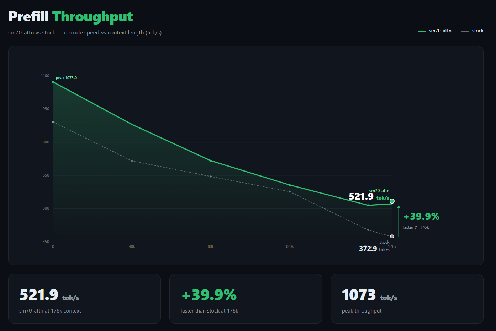

<div align="center">

# sm70-attn

**FlashAttention re-lit for Tesla V100 — a deep-custom fork of llama.cpp**

An SM 7.0 CUDA kernel plugin optimized for Qwen3.5/3.6/3.8-27B
(head_dim=256, GQA 6:1, 16 full-attention layers), with DFlash2
speculative decoding and multimodal fixes.


**English** · [中文](README.md)

</div>

---



## Why this fork exists

llama.cpp's stock flash-attention path has no tensor-core implementation for
SM 7.0 (Volta / Tesla V100). This repo ports a 1CatAI-verified Split-D N32 D256
kernel into llama.cpp master and builds the following on top of it:

- **8/23 root-cause fix**: the five-day "context contamination" case — the
  launcher assumed a head-major layout for the q4_0 dequant output (actually
  position-major `[ctx][head][D]`). A 9-line fix (`284b251`) zeroes the 0.69
  per-layer relative error;
- **SplitKV3**: 3-way KV split for long-prefix prefill, another +3.7% at 176k;
- **f32 output end-to-end**: attention output no longer stages through f16
  (per-layer rounding halved);
- **In-kernel q4_0 direct loads** (opt-in): XQA-style per-dtype template loads,
  saves ~470MB VRAM;
- **mtmd + dflash fix**: multimodal image + speculative decode crash on the
  M-RoPE position scale (upstream ggml-org#27408), fixed end-to-end.

Every behavior can be rolled back to the stock path with a single environment
variable, bit-for-bit identical.

## Performance

Single V100 · Qwen3.8-27B Q4_K_XL · `-fa on -ctk q4_0 -ctv f16`:

| Workload | stock | sm70-attn | Gain |
|:---|---:|---:|---:|
| 176k prefill (same-day 8/26 A/B, the only comparison) | 372.94 tok/s | 521.93 tok/s | **+39.9%** |
| 8k-context decode (tg64) | 28.99 tok/s | 29.06 tok/s | flat (model-forward bound) |

> Decode is measured independent of context length (attention < 0.1% of the
> step) — on a single card decode is bound by the memory bandwidth of the
> 17GB of weights, not by attention. This is exactly why we did **not** port
> the 1Cat XQA decode kernel (see "Technical deep dives · Upstream status").

## Quick start

```bash
# Build (needs CUDA >= 12.x; target GPU is Volta)
cmake -B build -DGGML_CUDA=ON
cmake --build build --target llama-server -j

# Production shape (27B main model + mmproj + DFlash2 spec decode)
./build/bin/llama-server \
    -m Qwen3.8-27B-UD-Q4_K_XL.gguf \
    --mmproj mmproj-BF16.gguf \
    --spec-type draft-dflash \
    --spec-draft-model Qwen3.8-27B-DFlash2-Q4_K_M.gguf \
    --spec-draft-n-max 2 \
    -fa on -ctk q4_0 -ctv f16 -c 229376 -b 4096 -ub 512 -ngl 99 \
    --host 127.0.0.1 --port 8080
```

Non-Volta / non-D256 / non-causal / decode / small batch (ne[1]<256) falls
back to the llama.cpp native path automatically — no config needed.

## Environment variables

| Variable | Default | Effect |
|:---|:---:|:---|
| `LLAMA_SM70_D256` | `1` | Master switch; `0` disables the plugin (bit-identical to stock) |
| `LLAMA_SM70_SPLITKV3_MIN_KV` | `2048` | SplitKV3 activation threshold (kv_len); `0` disables it entirely |
| `LLAMA_SM70_D256_Q4_DIRECT` | `0` | In-kernel q4_0 direct loads: ~470MB VRAM saved, ~4% prefill slower |
| `LLAMA_SM70_D256_DEBUG` | `0` | Print kernel selection probes (ACCEPT/REJECT + reason) |
| `SM70_DUMP` / `SM70_DUMP_KV` | off | Capture kernel inputs/outputs for offline repro & three-way blame |

## CI notes

This repo inherits the llama.cpp build CI matrix as compile checks for PRs
(15 build workflows + an hourly cache warm-up). The upstream docker / release
pipelines were removed (2026-08): this fork publishes no Docker images and no
full-platform releases, so unmaintained pipelines were cut. To restore any of
them, take the corresponding files straight from `ggml-org/llama.cpp`.

## Validation gates (overview)

Every change is guarded by these gates; all are self-contained and
re-runnable (`bash verify/<script>`):

| Gate | Content | Status |
|:---|:---|:---:|
| G4 harness | 23 cases: dense / f32-out / spiky / pos-major K,V / SplitKV3 edge / q4-direct | **23/23** |
| G5 three-way blame | First-layer ON-OFF error must sit at the f16 rounding floor (~5e-4) | ✅ |
| G3 / G3b | 46k / 176k prefill throughput A/B | ✅ |
| logit A/B | Greedy 128-token decode, zero divergence vs stock | ✅ |
| Multimodal regression | Image request 200 + correct visual description + text acceptance 0.88 | ✅ |

Full gate definitions (G1–G5 criteria and historical notes) in
"Technical deep dives · Validation gates (full)".

## Fix archives (full causal chains)

### Context contamination (8/23, 9-line fix, `284b251`)

**Symptoms**: 23 "amnesia" signatures in the 585eeb session — the model
continues recent context but forgets everything earlier.

**Root cause**: the launcher assumed `to_fp16_nc` writes its dequant dst as
`[ne2][ne1][ne0]` (head-major) but it actually linearizes as `[ne1][ne2][ne0]`
= position-major `[ctx][hkv][D]`. The old head-major strides (row=D,
head=ctx\*D) scrambled K on every q4_0-K prefill: every full-attn layer output
was off by ~0.69 relative error, which compounded into O(1) nat logit drift,
greedy argmax flips, and the "amnesia" signatures.

**Diagnosis**: `sm70_variant_scan.py` pinned it in 12 minutes — the
K-transposed variant dropped |v-C| from 0.69 to 0.08.

**Fix**: 9 lines (`284b251`); the `posK/posKV` regression cases are pinned in
the harness forever.

**Defense**: G5 three-way blame (ON-OFF-CPU f32 reference, three dumps), with
first-layer ON-OFF required to sit at the f16 rounding floor (~5e-4). Before
8/23, G1b had never run on the real kernel (COMMIT B) — that gap is how the
stride bug survived five days.

### Multimodal + spec decode crash (8/24, upstream #27408)

**Symptoms**: feeding an image under `--spec-type draft-dflash` crashed the
request with `llama_decode(ctx_dft) rc=-1` -> HTTP 500 "failed to process
mtmd chunk".

**Root cause** (inherited from the PR #27342 dflash2 port, tracked upstream as
ggml-org#27408): multimodal batches arrive with a CONSTANT position per row
(752 image rows all at pos 53; the spatial structure lives in the target's
M-RoPE machinery), while the following text continues at `image_pos +
grid_height` (53+47), not `image_pos + n_rows`. The draft's 1-D KV cache can
store neither shape — chunk 2 of the ubatch loop failed the continuity check.

**Fix** (three surgical changes in `common/speculative.cpp`):

1. `process()` skips embedding batches entirely; the hole is zero-filled with
   zero-feature encoder rows when the next token batch arrives (the target
   still validates every drafted token — output distribution stays exact,
   only the acceptance rate dips across the image span).
2. `draft()` places the noise block at the draft cache's own `pos_max + 1`
   instead of `dp.n_past` (token count vs position scale diverge after any
   image; the server's post-acceptance `seq_rm(pos_next, -1)` keeps `pos_max`
   exactly at the accepted context end).
3. The `begin()` pos_max-vs-N warning became a debug heuristic (token/pos
   divergence makes it meaningless after images).

**Validation**: image requests HTTP 200 with correct visual descriptions
(noise grid -> "pixelated checkerboard pattern"), zero decode failures,
zero-fill fires exactly once per image (47 rows for the logo), text-only
acceptance 0.88 (production-normal; image span dips to ~0.57 and recovers).
Repro: `verify/mtmd_repro.sh [image] [n]`; vision check:
`verify/mtmd_vision_check.py`.

## Technical deep dives

### Validation gates (full, G1–G5)

- **G1**: build clean; greedy decode 64 tokens top-1 identical vs stock,
  logit max diff < 1e-2.
- **G1b**: 176k full-prefill last-256 logits vs stock path: max abs diff
  < 1e-2, cosine > 0.9999 (f16 working precision).
  **8/23 note: never executed on the real kernel (COMMIT B) before 8/23 —
  that gap is how the stride bug survived five days. The equivalent evidence
  now is the G5 three-way dump verdict.**
- **G3**: 46k prompt prefill A/B (`bench/prompt_46k.txt`): cumulative tok/s
  46k >= 620, 30k >= 640, 4k within 5% of stock.
- **G3b**: 176k prefill A/B (`bench/prompt_176k.txt`): cumulative tok/s
  >= 380 (stock baseline 281.5). **8/26 final same-day A/B — the only
  benchmark kept in this repo: ON 521.93 / stock 372.94 tok/s (+39.9%). Same
  binary, same prompt (176340 tokens), `LLAMA_SM70_D256=0` vs default; prefill
  wall time 337.86s vs 472.83s (-28.5%).**
- **Rollback check**: `LLAMA_SM70_D256=0` reproduces stock bit-for-bit.
- **G4** (8/23): harness `verify/sm70_verify` — 19 cases, 0 failing (dense /
  f32-out / spiky / pos-major K,V / SplitKV3 incl. empty-segment edge).
  **8/24: extended to 23 cases — `q4K-pV` (full production geometry with
  direct q4_0 K + paged f16 V), `q4KV-279/3000`, `q4K-s3`; all at the f16
  noise floor (~1.7e-4), confirming bit-parity of the in-kernel dequant.**
- **G5** (8/23): three-way dump verdict — first-layer ON-vs-OFF must be at
  the f16 rounding floor (dense ~5e-4, splitkv3 ~3e-3) and layer-avg
  |A-C| == |B-C| (equal distance to the CPU f32 reference). See Tooling.

### q4-direct: why default OFF (8/24, from the 1Cat XQA architecture)

The kernel gained `Kq4/Vq4` template branches that read the RAW q4_0 block
cache (`[ctx][head][block]`, byte strides) and dequant straight into the
register fragments / smem panels (4/8-element groups, amortized block
addressing, aligned u16 nibble loads). Rounding is bit-identical to the
staged `to_fp16` path (exact f32 product + one RN), verified by harness
(`q4K-pV`/`q4KV`/`q4K-s3`, 23/23) and the logit A/B
(`verify/logit_q4direct.sh`).

**Why default OFF** (measured 8/24, V100, q4_0 K + f16 V): the study that
motivated the port contained a 1000x units error — the whole-cache dequant
staging costs ~0.1s of a 770s 176k prefill (28.7GB of traffic), not minutes.
Meanwhile the narrow loads make the attention kernel itself 3.6% slower at
176k (457 vs 474 tok/s). Net: the opt-in trades ~4% prefill speed for ~470MB
of VRAM (the f16 mirror at `-c 229k`) — only worth it when memory-bound.

### SplitKV3 (8/23 port of the upstream splitkv3 patch)

For long-prefix prefill chunks (kv_len >= threshold), the KV sweep is split 3
ways across `gridDim.y`, tripling CTA count so late chunks of a long prefill
stop serializing their KV scan on a saturated SM grid; a small merge kernel
combines the partial (max, sum, numerator) triples. 176k net gain is +3.7%
(420 -> 435.6 tok/s) — bounded by the HBM bandwidth wall, not SM occupancy.

Edge case upstream misses: a row's causal window can be fully masked within
one segment; our port initializes row_max to -1e30 (not -inf) in the SplitKV3
instantiation to keep `(-inf)-(-inf)=NaN` out of the partial chain.

### Upstream (1Cat-vLLM) status: exhausted (8/24)

Decision-grade measurements that closed the portability question (the full
8/23 study was deleted 8/24 once nothing actionable remained):

- **Prefill kernels**: Split-D vendored + fixed + splitkv3 — eaten clean.
  `_full` variant is a no-split simplification, nothing new.
- **XQA decode kernel (3490 lines)**: NOT ported, measured irrelevant —
  decode is model-forward bound on this GPU: tg64 @ ctx 0 = 28.99 tok/s,
  @ ctx 8192 = 29.06 tok/s. KV read is 24us of a 34ms step (<0.1%); even
  176k context is ~1.5%. Porting paged-KV/CUDA-graph machinery for that
  is a dead trade.
- **TurboQuant / FP8 KV / paged layout converters**: private quant formats
  and vLLM-specific infrastructure, not portable at kernel level.
- **flash_qla (GDN linear attention)**: the only open thread — gated on
  measuring GDN layer time share first (profiling workstream, not a port).
- **smem bank-padding know-how** (264/272-style constants): our vendor
  kernel already ships pitch-68 + Swizzle<3,3,3> + TT-swizzled V layouts.

## Debugging tooling (8/23, the kit that closed the case)

All under `verify/`; every script is self-contained and runs on the physical
box (`bash verify/<script>.sh`).

- `sm70_verify.cu` / `run.sh` — kernel harness, CPU f32 reference, md5
  fingerprint guard on the kernel source.
- `sm70_layer_diff.py` — layerwise ON/OFF diff from SM70_DUMP captures
  (`--c` adds the CPU f32 reference phase for three-way blame assignment).
- `sm70_variant_scan.py` — layout variant scan (this is what pinned the
  stride bug: K-transposed variant dropped |v-C| from 0.69 to 0.08).
- `sm70_repro.py` — minimal reproduction from a captured kernel-input dump.
- `dump_ab.sh` / `dump_cpu.sh` / `dump_kv.sh` — capture phases (env:
  `PROMPT`, `CT_V`, `ON_DUMP`, `OFF_DUMP`).
- `dump_ab.sh` + `SM70_DUMP`/`SM70_DUMP_MAX` env on the server — per-call
  attention output capture (hooks both sm70 and stock; CUDA-graph-capture
  aware; CPU twin hook in ggml-cpu/ops.cpp behind the same env).
- `logit_ab_fixed.sh` — three-phase logit fork verdict (A/A2/B + compare).
- `perf_ab.sh` / `perf_ab_176k.sh` — post-change throughput acceptance.

## Repository layout

```
ggml/src/ggml-cuda/
├── fattn.cu                     # selection hook (cc==700 + D256 + causal + prefill)
├── fattn-sm70-d256.cu           # launcher: Q staging / K,V dequant / dispatch
├── fattn-sm70-d256-kernel.cuh   # Split-D kernel + SplitKV3 + q4-direct branch
└── sm70-vendor/                 # cute/cutlass (Apache-2.0) + flash (BSD-3)
verify/                          # 23-case harness + three-way dump + blame tooling
bench/prompt_46k.txt             # standard workload (do not edit)
bench/prompt_176k.txt            # ROI workload (do not edit)
```

Key file details:

- `fattn.cu` — selection hook (guarded by cc==700 + head_dim==256 + causal
  mask + prefill ne[1]>=256; F16/Q4_0 K/V only). All other shapes keep the
  stock path. Also carries the SM70_DUMP debug hook.
- `fattn-sm70-d256.cu` — launcher: Q f32->f16 padded staging, K/V dequant +
  direct read (**pos-major strides**, see the 8/23 fix), attention launch,
  f32 output scatter. Scratch is carved from the get_alloc_size extra region
  (includes SplitKV3 partials).
- `fattn-sm70-d256-kernel.cuh` — the 1CatAI-verified Split-D N32 D256 kernel
  (provenance in its header). Documented deviations vs upstream:
  - `kv_offset` parameter + Mask construction using it (8/18);
  - `ElementOut` template parameter — production launcher instantiates
    `float` so the attention output stays f32 end-to-end (8/23);
  - `SplitKV3` template branch + `sm70_d256_splitkv3_merge_kernel` — 3-way KV
    split for long-prefix prefill (8/23, upstream splitkv3 patch), with an
    empty-segment gmem guard and a finite row_max init (-1e30) that upstream
    does not have.
- `sm70-vendor/` — header-only third-party closure: cute/ + cutlass/ (NVIDIA
  cutlass @ 62750a2b, Apache-2.0) and flash/ (FA2 base layer from
  zhinianqin/flash-attention-v100 @ c2eda5e6, BSD-3). See
  sm70-vendor/README.md for provenance.
- `sm70-hook.patch` — the fattn.cu hook as a standalone patch for rebase
  re-apply.

## Branches & sync

- `main`: working branch = upstream master + plugin (baseline
  `baseline-2026-08-18` = ggml-org/llama.cpp `25ae3a9b3`).
- Remote `upstream` (on the VM) -> ggml-org/llama.cpp; verified to merge
  cleanly (8/24: 103 commits merged, only workflow deletions conflicted,
  full-pipeline smoke pass).
- Physical build box does `git pull && cmake --build build` only.
- The `pre-merge-backup-0824` branch allows a full rollback.

## Commit chain

- `fe7a3e7ca` - v1.0 hook (pipeline validation, stock kernel) [COMMIT A]
- `bfc1e99` - v1.1 real SM70 D256 Split-D kernel + vendor closure [COMMIT B]
- `afa6e46` - logit_ab v3 final (the 8/22 verdict tooling)
- `284b251` - **8/23 stride fix** (the 0.69 root cause; K/V dequant strides
  are position-major)
- `daca614`..`0b76746` - 8/23 debugging kit (dump hooks, three-way analysis,
  variant scan, repro)
- `db66e31` - A-group hardening (F32 gating REJECT, posK/posKV harness
  regression cases)
- `6e2c53d` + `1ce3b3d` - **SplitKV3 port** (kernel branch + merge + gate +
  NaN edge fix)

## Credits & license

- [1CatAI/1Cat-vLLM](https://github.com/1CatAI/1Cat-vLLM) — upstream source
  of the Split-D D256 kernel and the SplitKV3 patch
- [zhinianqin/flash-attention-v100](https://github.com/zhinianqin/flash-attention-v100)
  — FA2 base layer (BSD-3)
- [NVIDIA/cutlass](https://github.com/NVIDIA/cutlass) — CuTe/CUTLASS header
  closure (Apache-2.0)
- [ggml-org/llama.cpp](https://github.com/ggml-org/llama.cpp) — host (MIT)

License follows upstream: MIT (llama.cpp parts) + BSD-3 (flash vendor) +
Apache-2.0 (cutlass vendor).
