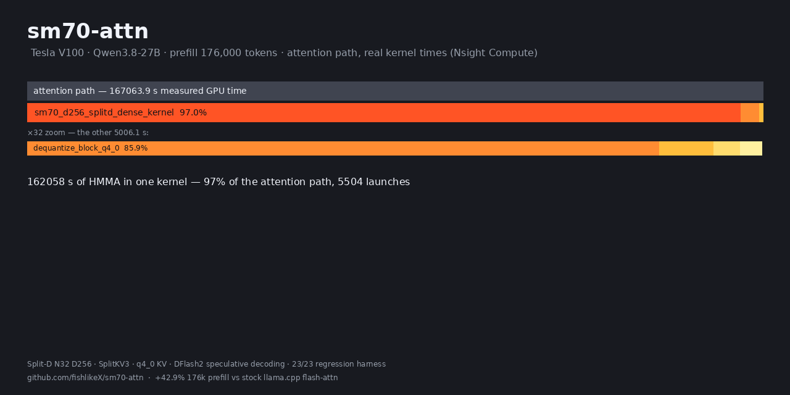

<div align="center">

# sm70-attn

**为 Tesla V100 重新点亮的 FlashAttention —— llama.cpp 深度定制分叉**

针对 Qwen3.5 / 3.6 / 3.8-27B（head_dim=256、GQA 6:1、16 层全注意力）
优化的 SM 7.0 CUDA kernel 插件，附 DFlash2 投机解码与多模态修复。


[English](README-sm70.md) · **中文**

</div>

---

## 为什么存在这个分叉

llama.cpp 的官方 flash-attention 路径对 SM 7.0（Volta / Tesla V100）没有
tensor-core 实现。本仓库把一颗经过 1CatAI 验证的 Split-D N32 D256 kernel
移植进 llama.cpp 主线，并在此之上完成：

- **8/23 根因修复**：五天悬案"上下文污染"——launcher 对 q4_0 去量化输出
  布局的头优先假设是错的（实际为位置优先 `[ctx][head][D]`），9 行修复
  （`284b251`），每层 0.69 的相对误差归零；
- **SplitKV3**：长前缀 prefill 的三路 KV 切分，176k 再 +3.7%；
- **f32 输出全链路**：注意力输出不再经过 f16 暂存（单层舍入减半）；
- **q4_0 核内直读**（opt-in）：XQA 风格的按 dtype 模板加载，省 470MB 显存；
- **mtmd + dflash 修复**：多模态图片 + 投机解码在 M-RoPE 位置刻度上的
  崩溃（上游 ggml-org#27408），端到端修通。

所有行为都可以用环境变量一键回退到 stock 路径，逐位对齐。

## 性能

V100 单卡 · Qwen3.8-27B Q4_K_XL · `-fa on -ctk q4_0 -ctv f16`：

| 负载 | stock | sm70-attn | 提升 |
|:---|---:|---:|---:|
| 176k prefill（G3b 同场 A/B，8/23） | 304.71 tok/s | 435.62 tok/s | **+42.9%** |
| 176k prefill（8/24 单发复测） | — | 474.00 tok/s | 当前最高 |
| 46k prefill（G3） | ≈ stock×1.0 | 613.25 tok/s | 长前缀增益显著 |
| 8k 上下文 decode（tg64） | 28.99 tok/s | 29.06 tok/s | 持平（模型前向瓶颈） |

> decode 实测与上下文长度无关（注意力占比 <0.1%）——单卡 decode 的瓶颈
> 是 17GB 权重的显存带宽，不是注意力。这正是我们**不**移植 1Cat XQA
> decode kernel 的决策依据（详见英文 README「Upstream status」）。

### 176k 注意力路径实测（Nsight Compute）



176,000 token prefill 的注意力管线耗时构成（V100 实测 kernel 时间）：
**splitd_dense kernel 占 97%（162 秒纯 HMMA）**，K 去量化 staging 仅
2.6%，SplitKV3 merge + Q 暂存合计不足 0.4%——注意力侧已无低垂果实，
这份数据同时是 XQA decode 不移植决策的量化依据。

## 快速开始

```bash
# 编译（需要 CUDA >= 12.x，目标 GPU 为 Volta）
cmake -B build -DGGML_CUDA=ON
cmake --build build --target llama-server -j

# 生产形态启动（27B 主模型 + mmproj + DFlash2 投机解码）
./build/bin/llama-server \
    -m Qwen3.8-27B-UD-Q4_K_XL.gguf \
    --mmproj mmproj-BF16.gguf \
    --spec-type draft-dflash \
    --spec-draft-model Qwen3.8-27B-DFlash2-Q4_K_M.gguf \
    --spec-draft-n-max 2 \
    -fa on -ctk q4_0 -ctv f16 -c 229376 -b 4096 -ub 512 -ngl 99 \
    --host 127.0.0.1 --port 8080
```

非 Volta / 非 D256 / 非 causal / decode / 小 batch（ne[1]<256）会自动走
llama.cpp 原生路径，无需配置。

## 环境变量

| 变量 | 默认 | 作用 |
|:---|:---:|:---|
| `LLAMA_SM70_D256` | `1` | 总开关；`0` 禁用插件（与 stock 逐位一致） |
| `LLAMA_SM70_SPLITKV3_MIN_KV` | `2048` | SplitKV3 激活阈值（kv_len）；`0` 彻底关闭 |
| `LLAMA_SM70_D256_Q4_DIRECT` | `0` | 核内 q4_0 直读：省 ~470MB 显存，代价 ~4% prefill 速度 |
| `LLAMA_SM70_D256_DEBUG` | `0` | 打印 kernel 选路 probe（ACCEPT/REJECT 及原因） |
| `SM70_DUMP` / `SM70_DUMP_KV` | off | 捕获 kernel 输入/输出用于离线复现与三相定责 |

## 验证体系

每一处改动都被这些门拦着，全部自包含可复跑（`bash verify/<脚本>`）：

| 门 | 内容 | 状态 |
|:---|:---|:---:|
| G4 harness | 23 个 case：dense / f32-out / spiky / 位置优先 K,V / SplitKV3 边界 / q4 直读 | **23/23** |
| G5 三相定责 | 第一层 ON-OFF 误差必须落在 f16 舍入地板（~5e-4） | ✅ |
| G3 / G3b | 46k / 176k prefill 吞吐 A/B | ✅ |
| logit A/B | 贪心解码 128 token，ON vs stock 零分叉 | ✅ |
| 多模态回归 | 图片请求 200 + 视觉描述正确 + 纯文本接受率 0.88 | ✅ |

## 两桩修复档案（细节见英文版）

**上下文污染（8/23，9 行修复）** q4_0 K 去量化后的布局被 launcher 按头优先
取 stride，实际是位置优先——每层输出偏差 0.69 复合成 O(1) nat 的 logit
漂移，表现为"失忆"。`sm70_variant_scan.py` 布局变体扫描 12 分钟定案，
`posK/posKV` 回归 case 永久钉死。

**多模态 + 投机解码崩溃（8/24，上游 #27408）** 图片 embedding 到达
process() 时每行位置都是常数（M-RoPE 空间结构只存在于 target），draft 的
一维 KV cache 存不了这种形状。修复：跳过 embedding 批次 + 零特征填洞 +
噪声块基点改用 draft cache 自身的 `pos_max+1`。输出分布精确不变，只有
图片区间的 draft 接受率轻微下降（0.88 → 0.57 → 恢复）。零填充思路来自
[z-lab fork #1](https://github.com/z-lab/llama.cpp-fork)；噪声块基点
（保住图片请求投机收益的关键增量）与端到端验证为本仓库工作。

## 目录速览

```
ggml/src/ggml-cuda/
├── fattn.cu                     # 选路钩子（cc==700 + D256 + causal + prefill）
├── fattn-sm70-d256.cu           # launcher：Q 暂存 / K,V 去量化 / 8 路分发
├── fattn-sm70-d256-kernel.cuh   # Split-D kernel + SplitKV3 + q4 直读分支
└── sm70-vendor/                 # cute/cutlass (Apache-2.0) + flash (BSD-3)
verify/                          # 23-case harness + 三相 dump + 定责工具链
bench/prompt_46k.txt             # 标准负载（勿改动）
bench/prompt_176k.txt            # ROI 负载（勿改动）
```

## 分支与同步

- `main`：工作分支 = 上游 master + 插件（基线 `baseline-2026-08-18`）
- 远端 `upstream` → ggml-org/llama.cpp；已验证可干净合并
  （8/24 合入 103 提交，冲突仅 workflow 删除项，全链路冒烟通过）
- 合并前的回滚备份分支（`pre-merge-backup-0824`）在合并验证通过后已删除；
  上游合并已由全链路冒烟与 23/23 回归锁定

## 致谢与许可

（按贡献代码体量排序）

- [ggml-org/llama.cpp](https://github.com/ggml-org/llama.cpp) —— 宿主，整个
  代码库的基础（MIT）
- [NVIDIA/cutlass](https://github.com/NVIDIA/cutlass) —— sm70-vendor 闭包中
  体量最大的部分：CuTe/CUTLASS 头文件 46k 行（Apache-2.0）
- [1CatAI/1Cat-vLLM](https://github.com/1CatAI/1Cat-vLLM) —— Split-D D256
  kernel 本体与 SplitKV3 patch 的上游来源——本仓库工作的核心对象
- [zhinianqin/flash-attention-v100](https://github.com/zhinianqin/flash-attention-v100)
  —— FA2 base layer，vendor 闭包的另一半（BSD-3）
- [z-lab/llama.cpp-fork](https://github.com/z-lab/llama.cpp-fork) ——
  DFlash2 投机解码工作的关联 fork；其 #1 零填充方案是我们 M-RoPE 修复
  的起点（我们补上了保持图片请求投机收益的噪声块基点部分）

许可随上游：MIT（llama.cpp 部分）+ BSD-3（flash vendor）+ Apache-2.0
（cutlass vendor）。
